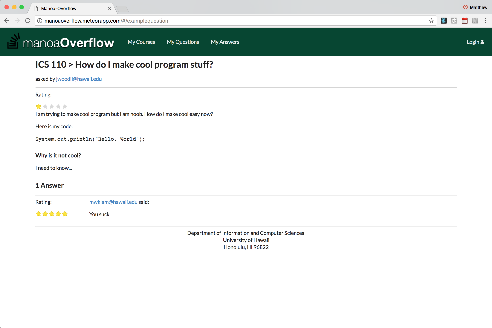

# Manoa Overflow

### Goals

-Provide forum-style support for students taking ICS courses at UH Manoa
-Questions and answers with context
-Encouraging students reach out for help
-Learning by teaching

### Services

-Provide a StackOverflow-style forum with questions organized by ICS course
-Students can navigate to a course and ask or answer questions pertaining to that course

### Page Mockups

##### Landing

The landing page will have all courses and include a search bar in the future.

##### Course Page

Each course page will have all questions pertaining to that particular course listed.

##### Question Page

Questions will have answers posted below. Both questions and answers have a voted rating out of 5 stars.